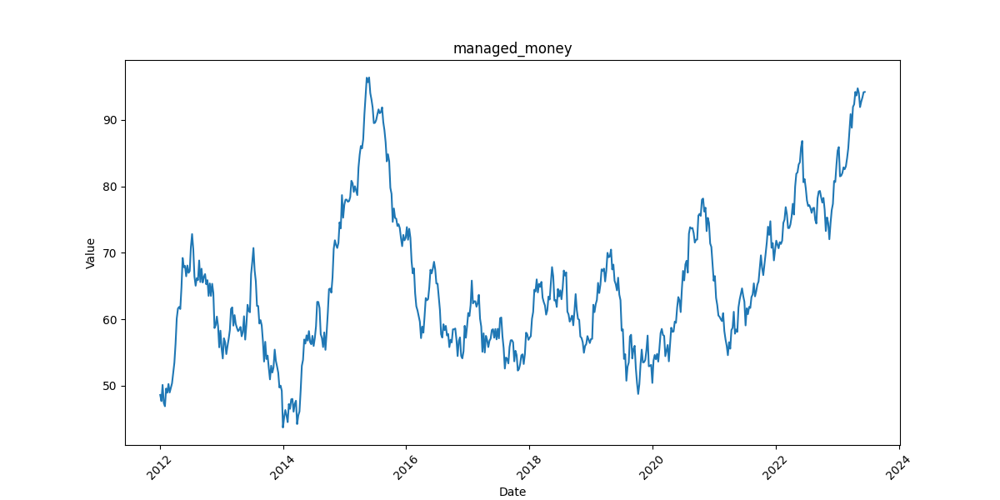
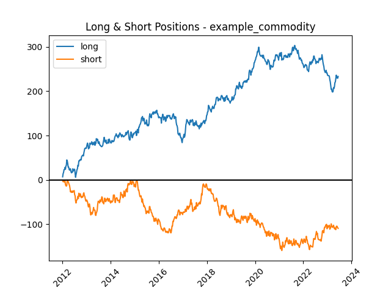
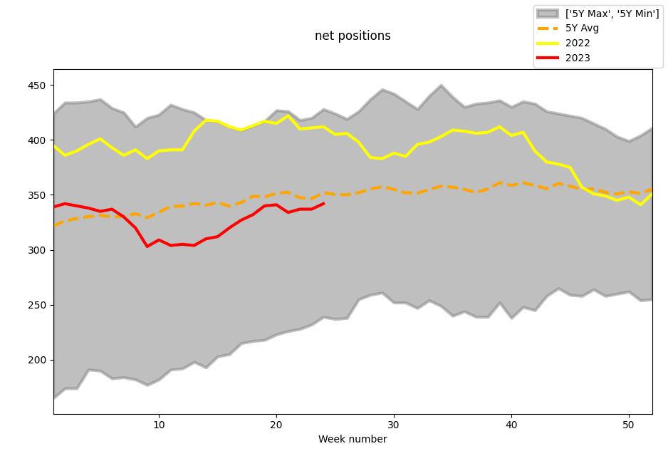
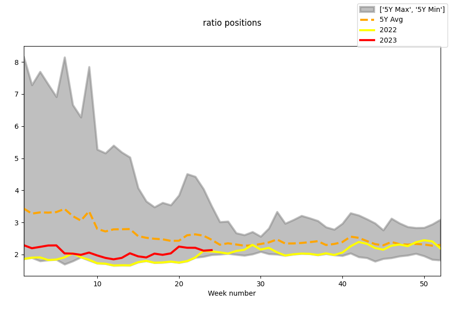
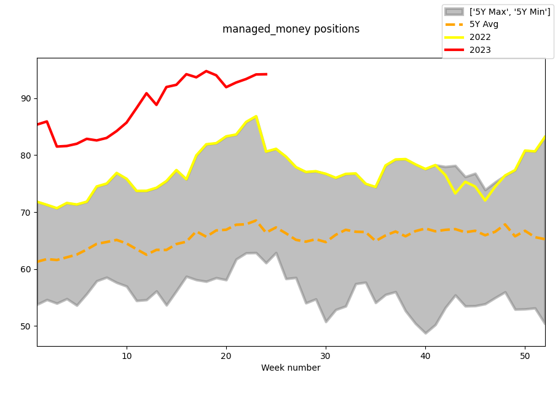

# Multiline_Chart_From_Single_SQL_Query

This is an example of an SQL query designed to prepare data for a chart showing current traders' positions in the light of the last 5 years. 
The goal of this task is to prepare charts based on Commitments of Traders (CoT) reports realesed by CFTC every week.
The COT reports include data as of the close of business on the preceding Tuesday. 
The only exceptions happen when the market is closed and in the US it can happen on: 1st January, 4th July and 25th December.
In the last two cases, Tuesday's release is moved to another day of the same week (usually Monday). Only when 1st January falls on Tuesday, the report is released next week.

## Process 

First, the data is generated by the simulation and written into a database. Secondly, the query is executed to represent positions in a weekly timeline, 
to compare the seasonal behaviour of the market in the current and previous years.

